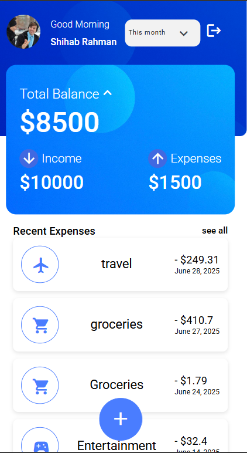
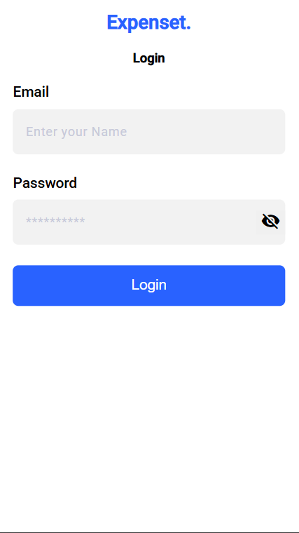
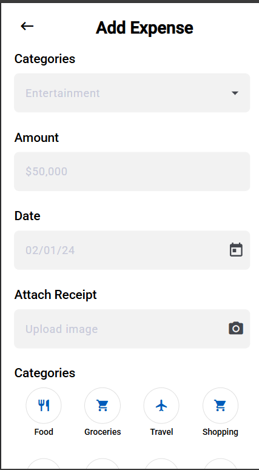

1-Overview of the architecture and structure
  a- the project folder structure conatains 
     - shared folder to contain shared reuseable components
     - features folder contains screen components
     - core folder contains (services, models, guards)
     - styles.scss and assets folder contain global styles
     - I have used Signals and Behavior subject for state management, Angular Material for icons, UI Components and Json Server for Backend APIs

2- API Integration
  a- I have used Json-Servser and adding (Expenses, users, currencies exchange rates)
  b- Add dateInt to add date as integer to enable json server to compare between dates in filter
  c- adding queries like page, per_page, sort, filter to filter, paginate and sort
  d- there are three users added
  e- showing loading  spinner in converted amount input while loading currencies exhcange rate and calculate the amount
3- ​Pagination strategy
  a- implamented through api (10 items per page) and handle pagination infinite scroll and add loading spinner under the current items while loading
4- The application consist of Login, Dashboard and AddExpens  screens 

5- to run the project 
  a- clone the repo
  b-run json-server --watch db.json in root folder
  c- run npm start in root folder
  d- login with user (shihab@example.com, pass1234) for more than 10 expenses 
  d- login with user (layla@example.com, layla2025!) for empty expenses 

6- Test cases 
 a- to run test cases run ng test (run only focused tests)
 b- I have implemented UI Test Cases in ProfileSectionComponent, test currency calculation and form validation in AddExpenseComponent and test Pagination in DashboardComponent
 
